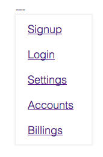

### Menu


##### install
    npm install menu-js

##### use

    var Menu = require('menu-js');

if not using browerify/webpack simply copy `menu.js` and `menu.css`.

See the examples in `example` folder.

##### create a menu

```javascript
new Menu({
    field: $('.menu-wrapper'),
    list: [
      '<a href="">Signup</a>',
      '<a href="">Login</a>',
      '<a href="">Settings</a>',
    ],
    menuTrigger: '---',
    onClick: function($node) {
      console.log($node);
    },
});
```

##### update menu
``` javascript
new Menu({
    field: $('.menu-wrapper'),
    list: [
      '<a href="">Logout</a>',
    ],
    menuTrigger: '---',
    onClick: function($node) {
      console.log($node);
    },
});
```
To `update` rerun the menu with new list.


##### generated html

```html
<div class="menu is-active">
    <div class="menu__trigger">---</div>
    <div class="menu__list">
        <div class="menu__item"></div>
    </div>
</div>
```

##### options
 - `menuTrigger` : the icon/text to open the dropdown. 
 - `openTo`: left - opens the menu to left. default - right.


##### Css
Copy the css from `menu.css` file.

- `is-active` is applied on menu-open.


